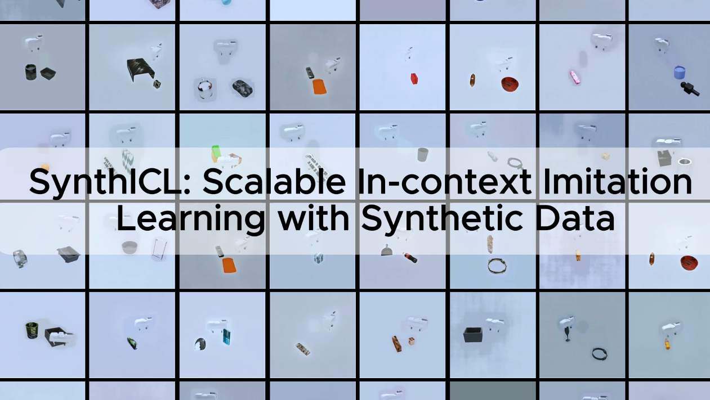

# SynthICL: Scalable In-context Imitation Learning with Synthetic Data

<p align="center">
  
</p>

Official training code for **SynthICL**, an RGB-only in-context imitation-learning policy trained on synthetic pseudo-demonstrations.

- [Project page](https://synth-icl.github.io/)
- [Paper](https://arxiv.org/abs/2606.08154)
- [Pseudo-demonstration generator](https://github.com/sNiper-Qian/synthicl-pseudo-demo)

This repository contains the model and training pipeline. Synthetic data is generated in the separate Isaac Sim repository linked above.

## 1. Generate pseudo-demonstrations

Generate the synthetic training data with the separate [SynthICL pseudo-demonstration generator](https://github.com/sNiper-Qian/synthicl-pseudo-demo). Its README contains the Isaac Sim setup, asset downloads, collection commands, output format, and troubleshooting instructions.

## 2. Install the training code

Create a Python 3.10 environment and install a CUDA-enabled PyTorch build. The versions below match the development environment:

```bash
git clone https://github.com/sNiper-Qian/synthicl.git
cd synthicl

conda create -n synthicl python=3.10 -y
conda activate synthicl
conda install pytorch==2.5.1 torchvision==0.20.1 pytorch-cuda=12.4 \
  -c pytorch -c nvidia
pip install -e .
```

Clone DINOv3 and obtain the gated ViT-S/16+ pretrained checkpoint by following the [official DINOv3 instructions](https://github.com/facebookresearch/dinov3):

```bash
git clone https://github.com/facebookresearch/dinov3.git
pip install -r dinov3/requirements.txt
```

The training command expects both the local DINOv3 repository and the `dinov3_vits16plus_pretrain_lvd1689m-4057cbaa.pth` checkpoint as explicit paths.

## 3. Train SynthICL

Run from this repository's root. `--dataset-dir` is scanned recursively, so it may point to a parent directory containing many generated partitions:

```bash
python scripts/train.py \
  --dataset-dir /path/to/generated-data \
  --dino-repo /path/to/dinov3 \
  --dino-weights /path/to/dinov3_vits16plus_pretrain_lvd1689m-4057cbaa.pth \
  --checkpoint-dir checkpoints
```

Weights & Biases logging is enabled by default under the `synthicl` project. To run without it:

```bash
python scripts/train.py \
  --dataset-dir /path/to/generated-data \
  --dino-repo /path/to/dinov3 \
  --dino-weights /path/to/dinov3_vits16plus_pretrain_lvd1689m-4057cbaa.pth \
  --checkpoint-dir checkpoints \
  --disable-wandb
```

Initialize from saved model weights:

```bash
python scripts/train.py \
  --dataset-dir /path/to/generated-data \
  --dino-repo /path/to/dinov3 \
  --dino-weights /path/to/dinov3_vits16plus_pretrain_lvd1689m-4057cbaa.pth \
  --checkpoint-dir checkpoints \
  --pretrained-path /path/to/model_5000.pth
```

The released defaults match the paper's training setup:

| Setting | Value |
| --- | --- |
| Image resolution | 256 × 256 |
| Context frames | Up to 6 waypoint frames |
| Camera views | Front, wrist, side |
| Action dimension / prediction horizon | 7 / 8 |
| Vision backbone | Frozen DINOv3 ViT-S/16+ |
| Transformer width / heads | 512 / 8 |
| Context / state-context / action-decoder layers | 8 / 7 / 2 |
| Subgoal decoder layers | 2 |
| Optimizer / learning rate | AdamW / `1e-4` |
| Task batch / samples per task | 8 / 8 (64 sampled steps per update) |
| Epochs | 2,000 |
| Gradient clipping | 1.0 |
| Action-time sampling | `Beta(1.5, 1.0)` over `[0.001, 0.999]` |
| Auxiliary subgoal loss weight | 1.0 |
| Inference flow steps | 10 |

Override operational settings with `--batch-size`, `--epochs`, `--num-workers`, `--eval-frequency`, `--save-frequency`, `--train-split`, and `--seed`. Use `python scripts/train.py --help` for the complete CLI.

Every run creates `CHECKPOINT_DIR/<run-name>/` containing:

- `config.json`, the complete resolved training configuration;
- `norm_stats.json`, dataset action/state ranges;
- periodic `model_<step>.pth` weights;
- `model_final.pth` after the final epoch.

## Citation

```bibtex
@article{qian2026synthicl,
  title   = {SynthICL: Scalable In-context Imitation Learning with Synthetic Data},
  author  = {Qian, Cheng and Fan, Ruomeng and Ren, Yifei and Wang, Yilong and Johns, Edward},
  journal = {arXiv preprint arXiv:2606.08154},
  year    = {2026}
}
```

## License

See [LICENSE.txt](LICENSE.txt).
